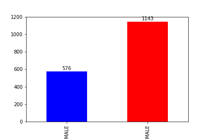
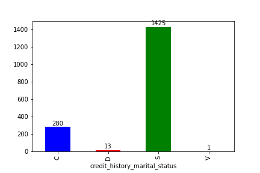
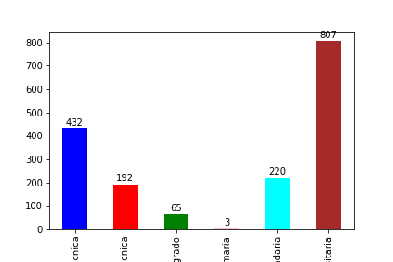
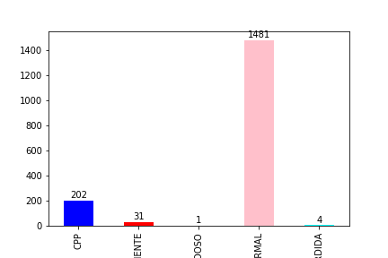
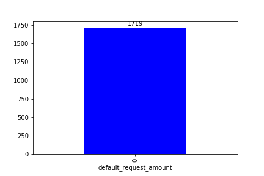

# Informe Trabajo Parcial Machine Learning

## Integrantes:
- Alegre Flores, Renzo Paolo
- Baldeón Albornoz, Braulio Sebastián
- Nuñez Robinson, Daniel

## Introducción

El presente trabajo busca desarrollar modelos de clasificación para poder apoyar la decisión de desembolsar un préstamo. La data que se empleará se encuentra disponible en este git 'datos_banco.csv'. La data cuenta con 14 atributos y 1719 instancias, donde el atributo a predecir 'target' que indica si una persona cayó en mora(1) o cumplió con los pagos(0).

## Análisis exploratorio

La data cuenta con 8 atributos cuantitativos y 6 cualitativos, incluyendo el primero. El primer atributo corresponde al indice de la instancia y no es utilizable para la clasificación.

### Data cualitativa

Se realizó un conteo de la cantidad de instancias según valor por cada atributo cualitativo.

   

<pre align="center"> Figura 1                                        Figura 2</pre>

   

<pre align="center"> Figura 3                                        Figura 4</pre>

Como se en la Figura 4, el valor 'Carrera técnica' del atributo 'person_degree_type_desc' se ha separado en dos por los caracteres especiales. Por lo tanto, un paso del pre-procesamiento será juntar estas instancias.

### Data cuantitativa

  

<pre align="center"> Figura 5 </pre>

Como se observa en la Figura 5, el unico atributo con missing values es 'var_employment_time_in_months' y que algunos atributos cuantitativos son tipo 'object', esto es debido q que los valores mayor a 1000 son representados con "," y almacenados como 'string'. Por lo tanto, un paso del pre-procesamiento será el tratamiento de missing values y la conversión de los atributos tipo 'object'

  

<pre align="center"> Figura 6 </pre>

Como se observa en la Figura 6, el atributo 'image_default_request_amount' solo tiene instancias con valor 0. Por ende, debe ser eliminado en el pre-procesamiento porque no tiene data utilizable para la tarea de clasificación.

  

<pre align="center"> Figura 7 </pre>

La Figura 7 es un gráfico de correlación entre los atributos cualitativos. Como se observa hay una alta correlación entre los atributos 'approved_amount', 'appreove_term', 'approved_interest_amount'. Lo cual es lógico porque a mayor monto de prestamo, mayor el tiempo para pagarlo y mayor el interes. Por otro lado, hay baja correlación entre los otras atributos.

También se uso la libreria seaborn para graficar un pairplot, el cual muestra la relación para (n, 2) combinación de variables en un DataFrame como una matriz de gráficos y los gráficos diagonales son los gráficos univariados

  

<pre align="center"> Figura 8 </pre>

Como se observa en la Figura 8, los gráficos univariados evidencia la existencia de outliers. Por lo tanto, un paso de del pre-procesamiento debe ser normalizar estos atributos.

## Tratamiento de datos

## Validación de los modelos

### Support Vector Machine
### Modelo 2
### Modelo 3

## Resultados finales

## Conclusiones
