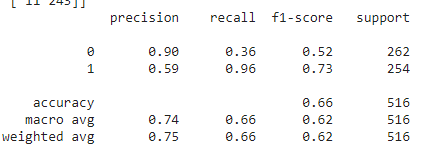
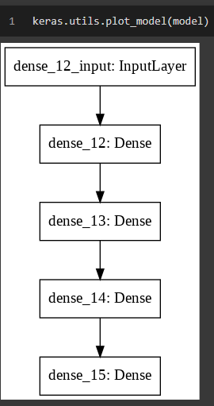
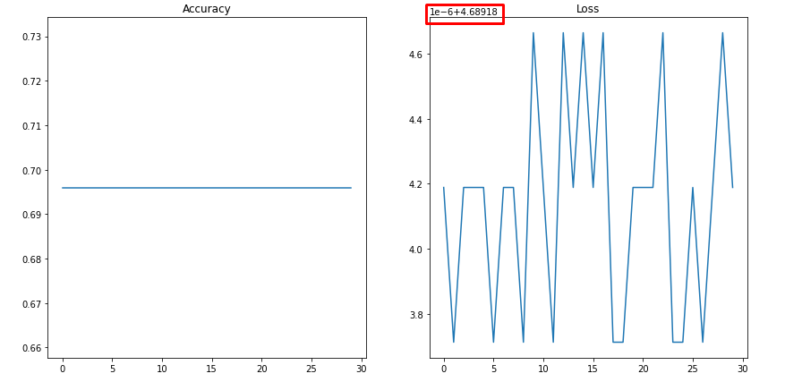
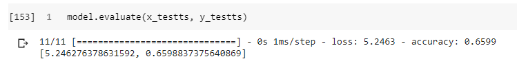
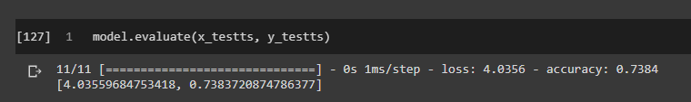

# Informe Trabajo Parcial Machine Learning

## Integrantes:
- Alegre Flores, Renzo Paolo
- Baldeón Albornoz, Braulio Sebastián
- Nuñez Robinson, Daniel

## Introducción

El presente trabajo busca desarrollar modelos de clasificación para poder apoyar la decisión de desembolsar un préstamo. La data que se empleará se encuentra disponible en este git 'datos_banco.csv'. La data cuenta con 14 atributos y 1719 instancias, donde el atributo a predecir ('target') indica si una persona cayó en mora(1) o cumplió con los pagos(0).

## Método

### Análisis Exploratorio

El dataset con el que se trabajará contiene data estructurada y cuenta con 8 atributos cuantitativos y 6 cualitativos, incluyendo el primero que corresponde al indice de la instancia. Por lo tando, no es necesario considerarla durante la elaboración de los modelos.

#### Data cualitativa

Se realizó un conteo de la cantidad de instancias según valor por cada atributo cualitativo.

   

<pre align="center"> Figura 1                                        Figura 2</pre>

   

<pre align="center"> Figura 3                                        Figura 4</pre>

Como se en la Figura 4, el valor 'Carrera técnica' del atributo 'person_degree_type_desc' se ha separado en dos por los caracteres especiales. Por lo tanto, un paso del pre-procesamiento será juntar estas instancias.

### Data cuantitativa

  

<pre align="center"> Figura 5 </pre>

Como se observa en la Figura 5, el unico atributo con missing values es 'var_employment_time_in_months' y que algunos atributos cuantitativos son tipo 'object', esto es debido q que los valores mayor a 1000 son representados con ',' y almacenados como 'string'. Por lo tanto, un paso del pre-procesamiento será el tratamiento de missing values y la conversión de los atributos tipo 'object'

  

<pre align="center"> Figura 6 </pre>

Como se observa en la Figura 6, el atributo 'image_default_request_amount' solo tiene instancias con valor 0. Por ende, debe ser eliminado en el pre-procesamiento porque no tiene data utilizable para la tarea de clasificación.

  

<pre align="center"> Figura 7 </pre>

La Figura 7 es un gráfico de correlación entre los atributos cualitativos. Como se observa hay una alta correlación entre los atributos 'approved_amount', 'appreove_term', 'approved_interest_amount'. Lo cual es lógico porque a mayor monto de prestamo, mayor el tiempo para pagarlo y mayor el interés. Por otro lado, hay baja correlación entre los otras atributos.

También se uso la libreria seaborn para graficar un pairplot, el cual muestra la relación para (n, 2) combinación de variables en un DataFrame como una matriz de gráficos y los gráficos diagonales son los gráficos univariados

  

<pre align="center"> Figura 8 </pre>

Como se observa en la Figura 8, los gráficos univariados evidencia la existencia de outliers. Por lo tanto, un paso de del pre-procesamiento debe ser normalizar estos atributos.

### Tratamiento de datos

Lo primero que se hizo fue eliminar los atributos con data no utilizable para la clasificación: 'idPrestamo' y 'default_request_amount'. El primero por ser un índice y el segundo porque el dataset solo contiene instancias de valor '0'.

En segundo lugar se recorrió el atributo 'person_degree_type_desc' para agrupar las instancias de valor 'Carrera Tecnica' que habian sido separadas en dos por lo caracteres especiales.

Después, se procedio a utilizar OneHotEncoding para transformar los atributos cualitativos en cuantitativos. Este metodo convierte la data cualitativa en un arreglo binario, como se puede observar en la Figura 9, para que el modelo pueda realizar una mejor predicción.

  

<pre align="center"> Figura 9 </pre>

Luego, se transformó la data tipo 'object' en data numérica. Para lo cual, se tuvo que convertir los valores mayores a 1000 que estaban almacenados como 'string' en 'float' para, posteriormente, trasnformarlos con el método 'pd.to_numeric'.

En quinto lugar, se empleó SimpleImputer, de la libreria 'sklearn', con estrategia de media para el tratamiento de missing values. El único atributo en el dataset que contenía NaN era 'var_employment_time_in_months'.

Finalmente, debido a que en el análisis se identificó la presencia de outliers se realizó la normalización de la data originalmente cuantitativa. Se utilizo MinMaxScaler de la librería sklearn en los siguientes atributos 'monthly_debt_capacity', 'var_employment_time_in_months', 'approved_amount', 'approved_interest_amount' y 'var_net_incom'.

### Validación de modelos 

#### Decision Tree Classifier

Modelo de clasificación supervisada donde los datos se dividen continuamente de acuerdo con un parámetro, los árboles de decisión constan de:
- Nodos, evaluan el valor de un determinado atributo.
- Ramas, corresponde al resultado de la evaluación y se conectan al siguiente nodo.
- Nodos hoja, nodos finales que corresponden a un valor del atributo objetivo (clase a predecir).

Los pasos que se seguimos para la construcción y validación de este modelo fueron los siguientes:

Primero, separamos nuestra data con una proporción 90/10 para probar el rendimiento de un DecisionTreeClassifier básico, implementado con la libreria sklearn.

   

<pre align="center"> Figura 10                                        Figura 11</pre>

Como se observa en la Figura 10, un árbol de decisión base obtuvo un 62% de accuracy con nuestra data. Así mismo, es notorio que el modelo no clasifica correctamente las instacias clase '1', posiblemente debido a que hay poca data de esta clase. También, se empleó 5-fold Cross-validation para evaluar el comportamiento del modelo con diferentes particiones del dataset. La Figura 11 muestra el accuracy obtenido en cada fold y la media de estos.

Después, se graficaron curvas de validación y de aprendizaje para el proceso de validación del modelo. 

   

<pre align="center"> Figura 12                                        Figura 13</pre>

La Figura 12 muestra la curva de validación para el hiperparámetro 'max_depth'. Como se puede observar el mejor accuracy conseguido con una profundidad máxima 3 y después de este punto la curva de entrenamiento y validación de sepraran, lo que indica que existe una alta varianza a mayor profundidad. 

Por otro lado, la Figura 13 muestra la curva de validación para el hiperparámetro 'min_samples_leaf'. A diferencia de la curva anterior, si el parametro es pequeño surje una alta varianza y esta disminuye cuando se incrementa el valor del parámetro. Específicamente, los valores 100, 110 y 120 son los que tiene mayor accuracy y los más cercanos a la curva de entrenamiento.

  

<pre align="center"> Figura 14 </pre>

La Figura 14 muestra la curva de aprendizaje del modelo, se observa que la de entrenamiento es muy cercana a 100% de accuracy lo cual es señal de overfitting. Por otro lado, la curva del cross-validation es muy variable a lo largo de las iteraciones. Además, entre las curvas existe una gran separación lo que indica un escenario de alta varianza. Es recomendable consegir más data o reducir la complejidad del modelo para mejorar el performance de este.

#### Neural Network (1er Dataset)

Modelos computacionales inspirados en el cerebro humano
- Neuronas: unidades de procesamiento
- Sinapsis: conexiones que intercomunican las neuronas

Los pasos que se seguimos para la construcción y validación de este modelo fueron los siguientes:
Para realizar el modelo se usaron las bibliotecas: pandas, numpy, matplotlib y sklearn.
Primero, el dataset es repartido en 4 porciones de prueba y los llamamos: 
"X_train, X_test, Y_train, Y_test"
Seguido, aplicamos KFold (10 splits o particiones).

La red neuronal fue ejecutada varias veces iterando sus atributos tales como número de capas, número de neuronas,el valor de alpha, etx.
Sin embargo, por más que estos hayan variado, el resultado fue muy similar. siendo el mejor promedio: 0.6489181194770927.

En la Figura 15, se aprecio la siguiente configuración de red neuronal:
red_neuronal = MLPClassifier(hidden_layer_sizes=(8,2), max_iter=100, learning_rate_init=0.01, activation='logistic')

  

<pre align="center"> Figura 15 </pre>

En la Figura 16, se aprecioa la siguiente configuración de red neuronal (con alpha = 0.2) :
red_neuronal2 = MLPClassifier(hidden_layer_sizes=(8,2), max_iter=100, learning_rate_init=0.01, activation='logistic', alpha= 0.2)

  

<pre align="center"> Figura 16 </pre>

En la Figura 17, se observa comportamiento que tuvo la neruona con la alteración de alpha = 0,2.

  

<pre align="center"> Figura 17 </pre>

En la Figura 18 se puede apreciar los resultados de cada uno de los 10 folds de la red neuronal 2 (alpha = 0.2)
Este es el mejor resultado de todos las muestras que se probaron.

  

<pre align="center"> Figura 18 </pre>

  

<pre align="center"> Figura 18.1 </pre>

Es necesario precisar que el valor promedio mayor fue 0.6489181194770927 el cual no es un valor muy favorable para aplicar, asimismo,
es necesario precisar que con un entrenemiento de mayor tiempo, el resultado puede incrementar y se puede obtener el mejor modelo iterando
alpha, número de capas y neuronas.

#### Keras Tensorflow Sequential Model

Modelo de clasificación que se puede crear capa por capa. Diseñado para entradas y salidas singulares, es decir que está diseñado en capas lineles. En este caso, el modelo se implementó con 4 capas Dense, con las siguientes activaciones:
- Selu
- Sigmoid
- Softmax
- Relu

Y se utilizaron en las pruebas los optimizadores:
- Adam
- SGD (Este se usó en el modelo final)
- Adagrad

La pérdida se midió con la función de 'binary-crossentropy'
La métrica utilizada fue la de precisión (accuracy)

Como un agregado a este modelo, se aplicó una extracción de las columnas más importantes utilizando Random Forest, para reducir el ruido en los datos y buscar una mejor precisión a la hora de evaluar el modelo. En este caso, buscamos las 15 filas más importantes de las 23 que existen en el dataset luego de procesarlo:

  

<pre align="center"> Figura 19 </pre>

El modelo toma la siguiente forma:

  

<pre align="center"> Figura 20 </pre>

La data se separó en 80% datos de entrenamiento y 20% datos de prueba y se entrenó y evaluó.

  

<pre align="center"> Figura 21 </pre>

A continuación se presentan las gráficas de Precisión y Pérdida:

  

<pre align="center"> Figura 22 </pre>
Como se puede observar, la precisión se mantiene estática a través de todo el proceso de entrenamiento, mientras que la pérdida cuenta con una variación mínima (alrededor de diezmillonésimas) pasando por las épocas, manteniéndose generalmente similar.

#### Naive Bayes
Se empleó el estimador MultinomialNB de la librería scklearn.

El proceso de validación que seguimos con este modelo fue el mismo que el de Decision Tree.

Primero, separamos nuestra data con una proporción 90/10 para probar el rendimiento de un MultinomialNB básico.

   

<pre align="center"> Figura 23                                        Figura 24</pre>

Como se observa en la Figura 23, un MultinomialNB base obtuvo un 70% de accuracy con esa partición específica de data. Así mismo, es notorio que el modelo no clasifica correctamente las instacias clase '1', posiblemente debido a que hay poca data de esta clase. También, se empleó 5-fold Cross-validation, la Figura 24 muestra el accuracy obtenido en cada fold y la media de estos.

Después, se graficaron curvas de validación y de aprendizaje.

   

<pre align="center"> Figura 25                                        Figura 26</pre>

La Figura 25 muestra la curva de validación para el hiperparámetro 'alpha'. Como se puede observar el mejor accuracy conseguido con un alpha cercano a 0. Por otro lado, las curvar no estan muy separadas indicando un caso de baja varianza.

La Figura 26 muestra la curva de aprendizaje del modelo, se observa que el ajuste adecuado es consegido con 700 instancias de train aproximandamente. También, se confirma que es un caso de baja varianza. Sin embargo, el accuracy del modelo es bajo lo que indica un posible caso de sesgo moderado.

## Resultados

Se empleó el metodo GridSearchCV para buscar la combinación de valores de hiperparámetros, previamente especifivados, que obtenga mejor acurracy. Los valores fueron acotados mediante la observación de las curvas de validación. Despues de obtener el mejor modelo, se realizó la predicción con la misma partición de data que se uso para el modelo base.

### Decision Tree Classifier

Los hiperparámetros sobre los que se iteró para este modelo fueron 'criterion', 'max_depth' y 'min_samples_leaf'.

   

<pre align="center"> Figura 27                                        Figura 28</pre>

Como se observa en la Figura 27, el modelo obtuvo un 72% de accuracy superando al modelo base. También, obtuvo un mayor valor de precision para la calse '1' lo que indica que el modelo pudo clasificar correctamenta una mayor cantidad de instacias de esta clase. Por otro lado, los resultados del 5-fold Cross-validation (Figura 28) son superiores a los del modelo base y hay una menor variación entre el resultado de cada fold.

### Modelo 2

Si agregas figuras porfa chequea los numeros de figura más abajo!
#### Keras Tensorflow Sequential Model

Sin la aplicación de la extracción de las columnas más importantes, la evaluación del mismo modelo resulta en los siguientes resultados:

  

<pre align="center"> Figura 29 </pre>

En la siguiente figura se encuentra la evaluación del modelo final:

  

<pre align="center"> Figura 30 </pre>

Como se puede observar, el modelo logró una precisión de 73.84% gracias al efectivo pre-procesamiento de los datos y la extracción de las 15 columnas más importantes, que fueron procesos claves para asegurar una clasificación más efectiva de las instancias.

### Naive Bayes
El hiperparámetro sobre el que se iteró para este modelo fue 'alpha'.

   

<pre align="center"> Figura 31                                        Figura 32</pre>

Como se observa en la Figura 31, el modelo obtuvo un 70% de accuracy. Por otro lado, los resultados del 5-fold Cross-validation (Figura 32) son similares a los del modelo base. Al igual que el modelo base, no clasifica correctamente las instancias de clase '1' reforzando la suposición de la existencia de sesgo moderado.

## Conclusiones

Se han aplicado distintos modelos predictivos de machine learning: Decision Tree, Naive Bayes, Keras Tensorflow Sequential Model, Neural Network. Estos modelos
fueron aplicados a un dataset de créditos bancarios, el cual fue pocesado de dos formas.

Los modelos tuvieron como resultado un accuracy que oscilna entre 62% a 73.84%, siendo el modelo Keras Tensorflow Sequential Model el que logró dicha precisión gracias al efectivo pre-procesamiento de los datos y la extracción de las 15 columnas más importantes, que fueron procesos claves para asegurar una clasificación más efectiva de las instancias.
